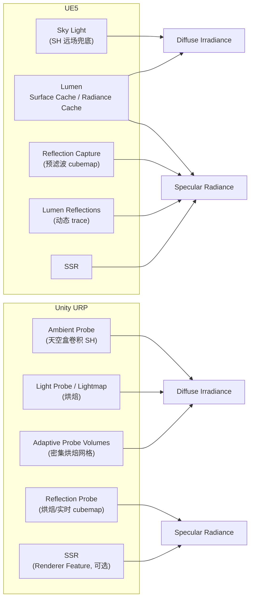

## TL, DR
1. 两边的环境光照在数学上收敛到同一套表示：diffuse 用低频 Spherical Harmonics（L2，9 系数）表示 irradiance，specular 用 split-sum 近似（prefiltered env map × EnvBRDF）表示 radiance。真正的差异不在公式，在"光照信息怎么生成、什么时候更新"。
2. UE5 靠 Lumen 把 diffuse 和 specular 的间接光都变成了全动态实时 trace（Surface Cache + Radiance Cache），Sky Light 的 SH 只是兜底的远场近似。
3. Unity URP 仍然以"烘焙 + probe 采样"为主线：Ambient Probe（天空盒卷积）、Light Probe / Lightmap（烘焙）、Adaptive Probe Volumes（密度更高的烘焙网格），动态更新基本靠手动开 Realtime Reflection Probe 或挂 SSR Renderer Feature 打补丁。
4. Specular IBL 的 `EnvBRDFApprox` 这个多项式近似（Karis, 2014）几乎是两边引擎源码里逐字一致的函数，算是图形圈里少有的"代码级共识"。

## 范围说明
本文对比基线：**UE5（默认开启 Lumen）** vs **Unity 6 / URP（引入 APV 之后）**。两个引擎的渲染管线都在持续迭代，旧版本（UE4 经典管线 / URP 无 APV 时代）结论会有出入，这里只讨论当前主流配置。

## 整体架构对比



| 维度 | UE5（Lumen） | Unity URP（APV） |
| --- | --- | --- |
| Diffuse 主力来源 | Lumen Surface Cache + Radiance Cache（全动态 trace） | Light Probe / Lightmap（烘焙）+ APV |
| Diffuse 兜底/远场 | Sky Light SH（L2，9 系数） | Ambient Probe SH（天空盒卷积） |
| Specular 主力来源 | Lumen Reflections（动态 trace）+ SSR | Reflection Probe（烘焙/实时 cubemap）+ SSR（可选） |
| Specular 预滤波 | GGX importance sampling 分 mip | Box filter 风格的卷积分 mip |
| 视差校正 | Box / Sphere Influence + Box Projection | Box Projection（可选开关） |
| 动态更新能力 | 场景几何/光照变化全自动跟随 | 依赖 probe 密度与刷新策略，非全动态 |
| 移动端默认路径 | 关闭 Lumen，退回传统 Capture + SH | 本身就是 Capture + SH，无需切换 |

## Diffuse 环境光照

### UE：Sky Light + Lumen

`USkyLightComponent` 有三种模式：

- **Static**：构建时通过 Lightmass 把天光烘焙进 lightmap，只影响静态物体。
- **Stationary**：烘焙间接光，但动态物体的阴影/响应仍实时计算。
- **Movable / Real-Time Capture**：周期性（或逐帧）把场景渲染成一张 cubemap，再投影成二阶 SH（9 个 RGB 系数），公式上就是标准的 irradiance map 近似：

```text
Irradiance(N) = Σ L_lm · Y_lm(N)   (l = 0..2)
Diffuse = Albedo / π · Irradiance(N)
```

这套 SH 在 Lumen 开启时退化为"远场兜底"——超出 Lumen trace 距离或者 Lumen 未覆盖的区域才会用到。真正承担间接 diffuse 的是 Lumen 的 **Surface Cache**（把场景表面的直接光+反照率缓存到一张全局纹理集合里）和 **Screen Probe / Radiance Cache**（在屏幕空间稀疏放置探针，向 Surface Cache 做 final gather），整个过程逐帧更新，几何、光照、材质变化都能立刻反映到间接光上，不需要任何手动烘焙步骤。

### Unity URP：Ambient Probe + Light Probe + APV

URP 没有等价的全动态 GI，diffuse 间接光分三层：

- **Ambient Probe**：Lighting 设置里 Environment Source 选 Skybox 时，引擎把天空盒卷积成一份全局 L2 SH（`unity_SHAr/g/b`、`unity_SHBr/g/b`、`unity_SHC`），作为没有更细粒度数据时的兜底，sample 方式和 UE 的 SH irradiance 公式完全一样。
- **Light Probe / Lightmap**：静态物体走 lightmap（Progressive Lightmapper 烘焙直接光+间接光，方向性 lightmap 还会存一张主光方向图改善法线响应);动态物体走手动摆放的 Light Probe，烘焙后每个探针存一份 L2 SH，运行时按四面体插值取最近 4 个探针。
- **Adaptive Probe Volumes（APV）**：用自动放置、密度自适应的"探针砖块"替代手动摆探针,solves 的还是烘焙问题，只是采样密度和过渡平滑度比传统 Light Probe 好很多，本质仍是离线烘焙 + 运行时插值,不是逐帧 trace。

简单说：UE 用 Lumen 把"生成 SH/irradiance 的过程"搬到了运行时实时 trace；Unity URP 把这个过程留在了烘焙阶段，运行时只做插值采样。

## Specular 环境光照

### UE：Reflection Capture + SSR + Lumen Reflections

经典管线下，关卡里手动摆 **Sphere Reflection Capture** / **Box Reflection Capture**，构建时把场景渲染成 cubemap，再用 GGX importance sampling 对每一级 mip 按递增 roughness 做预滤波——这就是标准的 split-sum 第一项：prefiltered environment map。多个 capture 互相重叠时按 influence 体积（球形衰减或 box 范围）做加权混合，Box Capture 还支持 **Box Projection** 做视差校正，让反射在非球形房间里不至于"贴图感"明显。

Lumen 开启后，**Lumen Reflections** 接管了大部分场景：通过 Surface Cache 或硬件光追做动态反射 trace，能正确反射运行时变化的几何体，不再依赖预先摆放的 capture；屏幕空间够不到的部分才会退回 Lumen Scene 的粗粒度表示。SSR 作为更高精度的屏幕空间补充叠在最上层。

第二项 EnvBRDF（环境 BRDF 积分）在 PC 上用预计算的 2D LUT（按 NoV、Roughness 查表），移动端为了省一次纹理采样，用 Brian Karis 在 *Physically Based Shading on Mobile*（2014）里给出的多项式近似：

```hlsl
float3 EnvBRDFApprox(float3 SpecularColor, float Roughness, float NoV)
{
    const float4 c0 = { -1, -0.0275, -0.572, 0.022 };
    const float4 c1 = { 1, 0.0425, 1.04, -0.04 };
    float4 r = Roughness * c0 + c1;
    float a004 = min(r.x * r.x, exp2(-9.28 * NoV)) * r.x + r.y;
    float2 AB = float2(-1.04, 1.04) * a004 + r.zw;
    return SpecularColor * AB.x + AB.y;
}
```

### Unity URP：Reflection Probe + SSR（可选）

URP 里没有 Lumen 这种全动态方案，Specular 间接光主力是 **Reflection Probe**：Baked 模式在编辑器里离线卷积出 cubemap 的多级 mip（按 roughness 递增模糊），Realtime 模式则是逐帧/周期性重新渲染六个面，成本明显更高，一般只在关键动态场景里少量开启。Probe 同样支持 **Box Projection** 做视差校正，多个 probe 重叠时按 Blend Probes / Blend Probes and Skybox 模式加权混合，思路上和 UE 的 capture 混合一致，只是基础设施更轻、卷积算法也更简单（接近标准 mipmap 模糊，而不是严格的 GGX importance sampling）。

SSR 在 URP 里是一个独立的 **Renderer Feature**，需要手动挂载才会启用,光线在屏幕空间步进，未命中时退回 Reflection Probe 或天空盒——这个 fallback 链路和 UE 是同构的，区别是 UE 里这条链路是管线默认自带的，URP 里是"按需开启"的可选项，符合 URP 偏移动端、轻量化的设计取向。

EnvBRDF 这一项,URP 的 `ImageBasedLighting.hlsl` 里的 `EnvironmentBRDFSpecular` 用的是同一套 Karis 多项式近似，和 UE 移动端路径几乎是同源代码,这也是这次对比里最值得记一笔的细节:两个完全独立的引擎，在 specular IBL 的第二项上用的是同一篇论文给出的同一个近似公式。

## 关键差异总结

| 维度 | UE5（Lumen） | Unity URP（APV） |
| --- | --- | --- |
| Diffuse 生成方式 | 运行时动态 trace（Surface Cache + Radiance Cache） | 离线烘焙（Lightmap / Light Probe / APV） |
| Specular 生成方式 | 运行时动态 trace（Lumen Reflections）+ 烘焙 capture 兜底 | 烘焙 cubemap（Realtime Probe 为例外） |
| Specular 预滤波算法 | GGX importance sampling | 类 mipmap 模糊卷积 |
| EnvBRDF | LUT（PC）/ 多项式近似（mobile，与 Unity 同源） | 多项式近似（与 UE mobile 同源） |
| 几何/光照变化响应 | 实时跟随 | 需要重新烘焙（APV 改善采样密度，不改变"需要烘焙"这一事实） |
| 硬件成本特征 | 依赖软件/硬件光追算力，GPU 开销大 | 烘焙阶段成本在离线，运行时开销小，但牺牲动态性 |
| 设计取向 | 一套管线打通高端动态光照 | 保留分层可选项，照顾移动端/低端硬件 |

## 思考
1. Diffuse 和 specular 在数学表示上两边没有本质区别——SH 表示低频 irradiance、split-sum 表示高频 radiance 是图形学里早就收敛的标准答案。真正决定体验差距的是"这些系数/cubemap 是怎么来的"：Lumen 把生成过程做成了运行时管线的一部分，URP 还停留在"美术/工具链离线生成，运行时只读"的阶段。
2. 对我们做 digital human / AR 场景这种需要环境动态变化（真实环境光估计、虚拟物体随真实光照实时响应）的场景而言，纯烘焙流程天然不适配，UE 的 Lumen 架构是更值得参考的范式,但要清楚代价是 trace 开销，移动端/端侧不能直接照搬,需要评估软件 trace 或者更激进的简化（比如固定几层 cascade 的 SH probe + 屏幕空间补偿）。
3. 之前提到 RealityKit 的 PBR 在金属高光表现上比 Unity 明显更好，结合这次梳理，怀疑差异更可能来自 capture 分辨率/mip0 精度或 EnvBRDF LUT 精度，而不是公式本身——两边用的近似公式高度同源,后面找几个标准金属球场景做定量对比（同一张 HDRI，同一组 roughness 梯度）应该能验证。

## Reference
1. Brian Karis, *Real Shading in Unreal Engine 4*, SIGGRAPH 2013 Course Notes
2. Brian Karis, *Physically Based Shading on Mobile*, 2014
3. Epic Games, Unreal Engine 文档：Sky Light / Reflection Environment / Lumen Global Illumination
4. Unity 文档：Light Probes / Reflection Probes / Adaptive Probe Volumes
5. Unity URP 源码：`ImageBasedLighting.hlsl`、`GlobalIllumination.hlsl`
6. Unreal Engine 源码：`BRDF.ush`、`ReflectionEnvironmentShading.usf`
