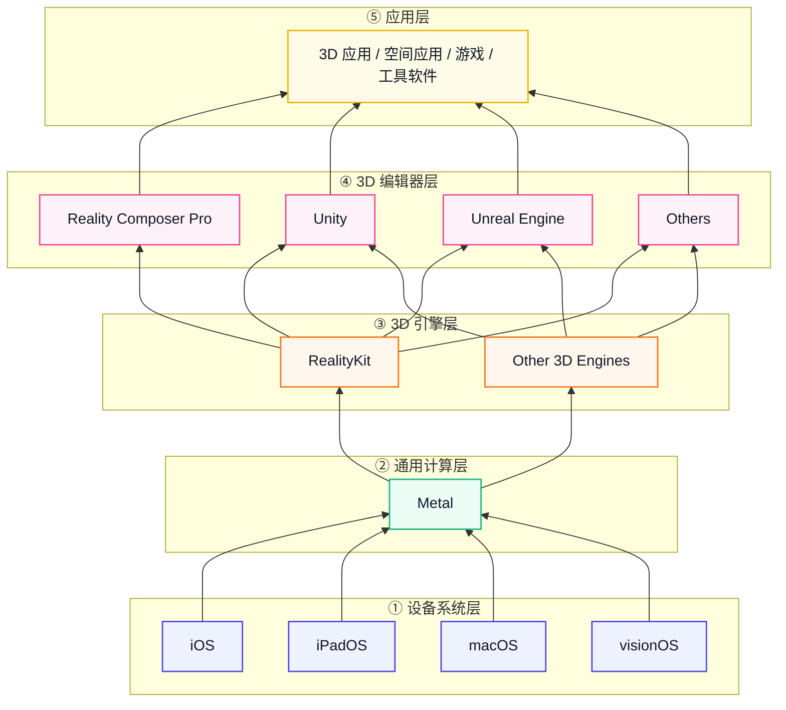

## TL, DR
1. AI 是重中之重，占比约 30%，在不同层面给了 AI 的方案，如Siri AI/Apple Intelligence/Foundation Models framework/CoreAI/Agentic Coding，没有强调自研大模型，更强调 AI 带来的用户体验和开发者体验。
2. Reality Composer Pro 3和RealityKit升级很大，能力更完整和系统化，并且大部分能力全部硬件平台共享。
3. 神经渲染、Metal等底层技术稳步推进，没有大创新但是做的越来越扎实。
4. 基于Metal的神经渲染、RealityKit里的布料仿真与3DGS、RCP3的数字人相关组件、visionOS的全景图转3D以及新版地图效果与我们强相关，后续会逐个研究下细节。

## WWDC26 Overview
宣传语：Intelligence rebuilt. Platforms refined. Tools transformed.
今年的报告统计如下：

```
├── AI / Agent 主线
│   ├── Foundation Models
│   ├── App Intents / Siri
│   ├── Evaluations
│   ├── Core Spotlight
│   └── Security for agentic features
│
├── 端侧模型主线
│   ├── Core AI
│   ├── MLX
│   ├── Metal tensors
│   └── Private Cloud Compute
│
├── 开发工具主线
│   ├── Xcode Agents
│   ├── Device Hub
│   ├── Instruments
│   └── Xcode Cloud
│
├── 空间计算主线
│   ├── visionOS 27
│   ├── RealityKit
│   ├── Reality Composer Pro 3
│   ├── USD / OpenUSD
│   ├── Object Tracking
│   ├── Spatial Preview
│   └── Foveated Streaming
│
├── 图形与游戏主线
│   ├── Metal
│   ├── Neural Rendering
│   ├── MetalFX
│   ├── MetricKit
│   └── Game Porting Toolkit
│
└── App 生态主线
    ├── Swift / SwiftUI / SwiftData
    ├── Design / Accessibility
    ├── Safari / WebKit
    ├── Camera / Media
    ├── StoreKit / App Store
    └── Security / Device Management
```

| 类别                                                     |      数量 |       占比 |
| ------------------------------------------------------ | ------: | -------: |
| AI / Apple Intelligence / App Intents / ML / Agent     |      30 |    28.0% |
| Swift / SwiftUI / UIKit / AppKit / App 框架              |      15 |    14.0% |
| visionOS / RealityKit / Reality Composer Pro / Spatial |      14 |    13.1% |
| Xcode / Instruments / Cloud / Dev Infra / Testing      |       9 |     8.4% |
| Camera / Photo / Audio / Video / Communication         |       8 |     7.5% |
| Design / Accessibility / Writing / Localization        |       8 |     7.5% |
| App Store / Commerce / Security / Trust                |       8 |     7.5% |
| Metal / Graphics / Games                               |       5 |     4.7% |
| Safari / Web                                           |       5 |     4.7% |
| 其他平台服务：HealthKit / CarPlay / Device / Accessories 等    |       5 |     4.7% |
| **合计**                                                 | **107** | **100%** |

占比最大的是AI，其次是开发框架、3D，涉及到 Apple 体系的方方面面。

## Apple‘s 3D Architect
下面是我理解的苹果对 3D 的架构设计，从操作系统到渲染API到引擎到编辑器，非常完整，且在引擎层及以上均提供三方定制能力。


## visionOS
*XR OS*

### 更多构建App的方式

| 路径                            | 适合对象                | 核心方式                                                                          |
| ----------------------------- | ------------------- | ----------------------------------------------------------------------------- |
| **兼容 iOS / iPadOS App**       | 已有移动 App            | 在 App Store Connect 勾选兼容，或重新编译到 visionOS                                      |
| **原生空间计算 App**                | 新开发空间体验             | SwiftUI、RealityKit、Reality Composer Pro、CompositorServices、Unity、Unreal、Godot |
| **Mac / PC 内容扩展到 Vision Pro** | 已有桌面 3D / 工业 / 游戏应用 | Spatial Preview、Foveated Streaming                                            |

### Object Tracking
- high-frame-rate tracking，更高频率的 pose 更新意味着物体移动时系统反应更快，
- Create ML extended training，
- metric space pose API，可以返回没有经过显示修正（平滑+畸变考虑）。

### Foveated Streaming
- 设备输入：Vision Pro 发送手部、控制器、麦克风等输入；
- 云端渲染：OpenXR 内容；
- 串流：通过 NVIDIA CloudXR 低延迟串流；
- 优化：根据用户注视区域进行 foveated compression，注视区域高清，周边区域低码率，降低带宽。

### 全景照片转3D
自己拍摄的全景照片也能转换为空间场景。后面需要真机测试一下，宣传视频没看出来3d感。


### 思考
没看到太多独占性的新功能，除了Foveated Streaming和沉浸式音频，其他大都为现有功能的例行升级，大概率是因为这块的研发速度因为业务调整有点放慢了。

## Reality Composer Pro 3
*官方 3D 编辑器，用于组合 3D 场景、创建材质、添加视觉特效、设置灯光、构建交互等工作的视觉编辑器。*

| 功能                                                        | 含义                                         |
| --------------------------------------------------------- | ------------------------------------------ |
| **Reality Composer Pro Assistant**                        | AI 生成 3D 模型、纹理、材质，并放入场景                    |
| **Animation Graph**                                       | 用状态机管理动画切换，比如 idle / walk / run            |
| **Navigation Meshes**                                     | 自动生成并编辑导航网格，支持障碍、跳跃、梯子等                    |
| **Script Graph**                                          | 节点式逻辑系统，不写代码也能做交互                          |
| **Shader Graph 增强**                                       | 支持 subsurface scattering，可做皮肤、眼睛、头发、传送门等材质 |
| **Behavior Trees / Compute Graphs / Custom Script Nodes** | 更接近游戏引擎编辑器能力                               |
|                                                           |                                            |
### Animation Graph
用于控制角色在运行时如何播放、切换、混合动画。


### Behavior Tree
Animation Graph 解决的是“角色怎么动得自然”，Behavior Tree 解决的是角色行为流程。


### Script Graph
定义场景中的交互和功能逻辑，基于event-driven，也就是由事件触发执行。


### Navigation Mesh
让角色能够从一个点走到另一个点，并自动绕开障碍。

### Compute Graph
类似于 VFX Graph，实现GPU 驱动的粒子模拟。


### Shader Graph
进一步补强，增加Subsurface Scattering，RealityKit PBR Surface 2，Hair Surface，Portal Surface，Portal Geometry Modifier。这些材质后续会花时间研究一下，和我们提供的SSS，Hair做一个横向对比，取长补短。

### 思考
1. Reality Composer Pro 3前面的存在感不强，前面两代实际使用中体感不好，要么动不动卡死，要么部分编辑操作反人类，相比于 Unity/UE 这样的编辑器差距巨大。但是，苹果对其定位是官方的 3D 编辑器（生态中不可或缺的重要环节），并且不断坚持完善功能，今年补齐了大量的功能，把角色、渲染、脚本等往前走了一大步，这很“苹果”。
2. 对比看Reality Composer Pro 3，与我们对普适的 3D 互动的思考是一致的，基本覆盖了我们这几年花了大量时间建设的 NavMesh、BT、Shader Graph、Script Graph 、VFX Graph能力，当前也在构建 Anim Graph。
3. 比较可惜的是，当前我们自研编辑器是暂停的状态，这块当前还是深度和 Unity 编辑器绑定，好处是 Unity 编辑器好用生态成熟，坏处是部分环节开发工作量翻倍，且受限于 Unity 的既有框架限制部分能力难以实现（如 GPU Driven 3DGS Render Pipeline）。

## RealityKit
*官方 3D 引擎 on iOS, iPadOS, MacOS, visionOS


| 功能                          | 作用                             |
| --------------------------- | ------------------------------ |
| **Physical Space Lighting** | 让虚拟光照更自然地融合真实空间                |
| **Projective Textures API** | 给聚光灯添加投影纹理，可做星空、彩窗、水下焦散等效果     |
| **Cloth Simulation**        | 实时布料模拟，可用于服装、床单、软体布料           |
| **Custom Reverb Mesh**      | 根据虚拟空间材料模拟空间混响                 |
| **Gaussian Splatting**      | 支持用 3D Gaussian Splat 表示真实扫描物体 |

### 渲染
1. Lightmaps，提供漫反射光照计算的离线烘焙能力，

2. Soft Shadows，新增软阴影 & CSM，

3. Projective Textures，类似于 Unity Light Cookie，提供光照强度的像素级控制，

4. Physical Space Lighting，开启后虚拟 spot light / point light 可以与现实空间的 scene understanding mesh 交互（很赞！），*visionOS 独占*，

#### 导航
新增Navigation Mesh，也支持off-mesh connection，补充了角色能在空间中自主行动的基础设施。


### 布料模拟
新增布料模拟，支持必要的 Body Collisions，Pin Constraints，物理属性设置。


| 组件                       | 作用                                   |
| ------------------------ | ------------------------------------ |
| ClothBodyComponent       | 表示布料本体                               |
| ClothColliderComponent   | 表示可碰撞刚体，例如床、人体模型                     |
| ClothSimulationComponent | 运行布料模拟，配置 solver、gravity、time step 等 |
| Cloth material           | 定义布料属性，如 stiffness、friction          |
| Collider material        | 定义碰撞体材料属性                            |


### 性能

新增Mesh LOD，通过 LevelOfDetailComponent 切换，Camera distance/Screen area两种模式。


支持Thermal State 监控，监听 thermalStateDidChange，根据当前设备状态进行降级，上面新增的效果都需要算力，需要动态开关。


### 3D Gaussian Splats

使用挺简单直接的，和我们当前设计基本一致：

准备 splat 属性 buffers
    position
    scale
    rotation
    opacity
    spherical harmonics
        ↓
BufferResource
        ↓
GaussianSplatResource          --- Gaussian Buffers & RTs
        ↓
**GaussianSplatComponent**    --- GaussianRenderer
        ↓
attach to Entity                         --- Node
        ↓
RealityKit 渲染                           --- AceNNR

单个 component 限制 3DGS 数目为～20W。


### 沉浸式音频, *visionOS独占*
支持自定义Reverb Mesh，提供和真实环境更贴合的空间混响计算。

定义 ReverbMeshResource
    ↓
指定几何形状
    ↓
绑定音频材料
    ↓
生成 reverb component
    ↓
attach to entity


### 思考
1. RealityKit 支持了 3DGS 的渲染，也很自然，毕竟这块的基础能力早已具备，只是什么对外暴露能力而已。
2. 渲染能力的增强也很符合直觉，这些都是实时渲染里的性价比很高的技术。
3. 比较意外的是，增加了布料仿真能力，端侧里，布料仿真技术一般只会在对服饰效果很在意的细分应用（比如暖暖）才会采用，暂时不清楚的是选用什么求解器，看官方文档只允许设置 Jacobi/Gauss Seidel，大概率是 PBD 系列了。
4. 对比RealityKit，图形层面当前没有高级软阴影/布料仿真/Projective Textures，其他的我们至少不弱于 RealityKit，现在缺失的能力后面也会慎重评估一下重要程度看是否需要补上。整体来看，我们相比于RealityKit的优势在缩小，但跨平台支持上的优势应该会持续存在。
5. RealityKit的PBR Shading Model对于金属表达比Unity明显好，主要反映在高光建模，这点我们前面做了一些分析，后面结合新的3d模型需求进一步完善，把现有的渲染效果做提升。

## Metal
*底层高性能图形与通用计算 API*

### 硬件架构升级
M1：Apple GPU 进入 Mac，统一内存架构，高能效
M2：shader cores 增加，cache 和 memory bandwidth 提升
M3：新 shader core、dynamic caching、硬件光追、mesh shading
M4：更快 core、2x ray tracing engine、更高 memory bandwidth
M5：GPU neural accelerators、**2x FP16/complex ALU**、**2x geometry throughput**、+30% bandwidth、二代 dynamic caching、三代 ray tracing、**universal texture compression**

### 神经渲染
关键趋势：很多传统依赖解析方法的渲染技术，正在被机器学习方法替代或增强。


| 层次  | 技术                              | 适合场景                              | 抽象程度    |
| --- | ------------------------------- | --------------------------------- | ------- |
| 高层  | MetalFX Denoising / Upscaling   | 实时 path tracing、游戏、专业 viewport    | 最高，黑盒   |
| 中层  | ML Command Encoder + MTLPackage | 神经 tone mapping、神经后处理、离线训练模型部署    | 中等      |
| 底层  | TensorOps API                   | 小型 MLP、inline shader network、在线训练 | 最灵活，最底层 |

#### MetalFX
*平台级神经渲染黑盒*
提供的能力有：
1. MetalFX Denoising，对实时路径追踪结果进行降噪，
2. MetalFX Spatial Upscaling，空间超分，FSR，
3. MetalFX Temporal Upscaling，时序超分，TAAU，
4. MetalFX Frame Interpolation，插帧，

MetalFX Denoising为例，框架如下：


#### Metal 4 ML Command Encoder
把自定义模型放进 command buffer，允许开发者把一个预训练模型直接部署到 Metal command buffer 中，与 render / compute 工作在同一帧、同一 command buffer 中调度。

比如研发Neural Tone Mapping，用一个 neural network 学习整个 color transformation，基于HDRNet架构（这块对我们现在的生成模型渲染的校色也有参考意义，可以深入研究一下）。


#### TensorOps API
允许开发者在 shader 里直接构建小型神经网络，例如小 MLP。

Sky Illumination Model适合用这个方式去做。传统做法是预计算 Skybox 的 irradiance（如 SH），运行时采样，只能处理静态天空盒。动态下，往往需要进行动态积分计算，考虑到Diffuse光照通常比较平滑，可以用一个小网络学习这个可变光照函数，即输入 float3 -> (3 - 4 - 4 - 3 MLP) -> 输出 float3。


比较有意思的是，这个 MLP 可以在线学习，采样少数方向，更新 MLP 网络，比半球积分划算。


## Intelligence 

### 架构
Siri AI
  ↓
Apple Intelligence
  ↓
Foundation Models framework
  ↓
Apple Foundation Models / Claude / Gemini / other LLM providers
  ↓
Private Cloud Compute / on-device model

| 名称                              | 面向谁         | 本质定位                                   | 类比                                                    |
| ------------------------------- | ----------- | -------------------------------------- | ----------------------------------------------------- |
| **Apple Intelligence**          | 普通用户 + 系统应用 | Apple 对外的“智能功能品牌/产品层”                  | iOS/macOS 里的 AI 能力总称                                  |
| **Foundation Models framework** | App 开发者     | 调用 Apple Foundation Models 的 Swift API | “给 App 用的本地/云端大模型接口”                                  |
| **Core AI**                     | 模型开发者/底层开发者 | 在 Apple Silicon 上部署、运行 AI 模型的底层推理技术栈   | 类似 Apple 版端侧 AI runtime / compiler / deployment stack |

### Siri AI
定位为“Entirely New Version of Siri”，深度集成到 iPhone、iPad、Mac、Apple Watch 和 Apple Vision Pro。它可以理解用户屏幕内容、利用个人上下文跨消息/邮件/照片等应用搜索，并通过更多 systemwide app actions 完成跨应用任务。
在 visionOS 中，Siri AI 将呈现为一颗可四处移动放置的圆球，调用时无需提示词，注视并说话即可唤醒。Siri AI 也可以自动识别你正在注视的内容，包括现实世界中的对象，然后结合世界知识与个人上下文给出有用的建议。


### Apple Intelligence
提供的是系统层面的 AI 能力，不只是 Siri能用，也扩到 Photos、Safari、Messages、Mail、Image Playground 等系统应用中。比如 Photos 有 Spatial Reframing；Image Playground 支持更高质量、甚至 photorealistic 风格的图像生成；Safari 有 Notify Me，可以监控网页变化，比如补货或降价；Messages 根据对话上下文给出一键创建提醒或笔记等建议。模型上引入了Gemini，宣称引入了训练 Gemini 模型所用的技术、并重新训练了 Apple Foundation Models。


### Foundation Models framework 
提供原生 Swift API，可以直接访问驱动 Apple Intelligence 的端侧模型；现在还可以接入任何符合 Language Model protocol 的语言模型，包括 Apple Foundation Models、Claude、Gemini 或其他 provider。它还支持多模态 prompt，允许图像和文本一起输入；Vision 框架里的 OCR、barcode reader 等工具也可以被模型在端侧调用。

### Core AI
内置到 OS、面向 Apple Silicon、用于把开发者自有模型部署到端侧的框架。它提供 memory-safe 的 Swift API，可加载、specialize、运行 AI 模型，强调本地运行、用户数据隐私、无服务器依赖、无 token 成本。

### Agentic Coding
Xcode 27 的重点是 coding agents。Xcode 27 允许开发者使用自己选择的模型驱动 coding agents；这些 agent 可以在不同开发阶段承担不同粒度的任务，比如生成原型、补实现细节、打磨最终体验。

### 思考
啥时候顶配1TB国行 iPhone Pro Max 可用？

## Misc
### Liquid Glass
系统设置里新增 Liquid Glass 调节滑杆，用户可以在 ultra-clear 到 fully tinted 之间调整。


### 基础性能
iPhone/iPad app 启动最多快 30%，拍照后照片加载最多快 70%，AirDrop 传输最多快 80%，iPad 外接硬盘文件浏览和传输最多快 5 倍；Spotlight、Photos、Mail 的搜索体验也被重构以提高稳定性和效率。

### 网络优化
iPhone 现在会更智能地判断什么时候该保持当前网络连接、什么时候该切换网络。

### 家长控制与儿童安全
新增了更强的儿童账户设置、Ask to Browse、Allowed Apps、Communication Safety、按类别设定每日使用时长、日程化访问控制等。Communication Safety 还会从裸露内容扩展到血腥/暴力图像或视频干预。

### Apple地图
Apple地图中的俯瞰也有所升级，通过将航拍图像和视觉智能模型相结合（官方说辞，大概率是3DGS，大规模场景的3DGS渲染发展很快，结合流式和LOD可以做到端侧实时），俯瞰中的城市渲染效果很逼真且有细节。

## Reference
1. [Overview] https://developer.apple.com/videos/play/wwdc2026/122/
2. [VisionOS] https://developer.apple.com/videos/play/wwdc2026/287/
3. [RealityKit] https://developer.apple.com/videos/play/wwdc2026/279/
4. [Apple Intelligence] https://developer.apple.com/wwdc26/guides/apple-intelligence/
5. [Reality Composer Pro] https://developer.apple.com/videos/play/wwdc2026/393/
6. [Reality Composer Pro] https://developer.apple.com/videos/play/wwdc2026/252/
7. [Metal] https://developer.apple.com/wwdc26/guides/metal/
8. [Metal] https://developer.apple.com/documentation/Metal/understanding-the-metal-4-core-api
9. [API Docs] https://developer.apple.com/documentation/realitykit/


